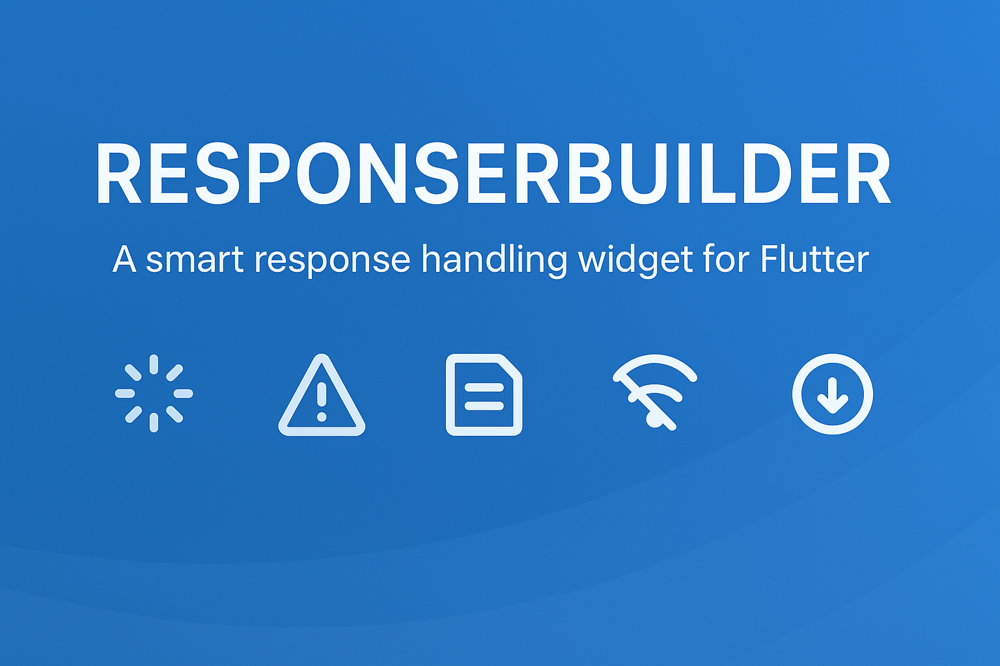

# 📦 smart_response_builder



[](https://pub.dev/packages/smart_response_builder)  [](https://pub.dev/packages/smart_response_builder/score) [](https://pub.dev/packages/smart_response_builder/score) [](https://pub.dev/packages/smart_response_builder/score)
 [](https://pub.dev/packages/effective_dart) [](https://flutter.dev) [](https://opensource.org/licenses/MIT)

A Flutter widget to handle API states with ease — loading, error, empty, offline, and pagination in one unified solution.

---

## ✨ Features

- ✅ Unified handling of **Loading**, **Error**, **Empty**, and **Data** states  
- ✅ Built-in support for **Offline** state with customizable retry
- ✅ Seamless **Pagination** support (`isLoadingMore`, `hasMore`, `paginationError`)
- ✅ Works with any **state management** (GetX, Provider, Riverpod, BLoC, etc.)
- ✅ Highly **customizable builders** for full UI control
- ✅ Lightweight, no heavy dependencies

---

## 📥 Installation

Add the dependency to your `pubspec.yaml`:

```yaml
dependencies:
  smart_response_builder:
    git:
      url: https://github.com/mirzamahmud/smart_response_builder.git
```

or

```yaml
dependencies:
  smart_response_builder: ^1.0.0
```

or

```bash
flutter pub add smart_response_builder
```

Then run

```bash
flutter pub get
```

---

## 🚀 Usage

### 🔹 Basic Example

```dart
ResponseBuilder<List<String>>(
  isLoading: false,
  data: ["Apple", "Banana", "Orange"],
  dataBuilder: (context, data) => ListView(
    children: data.map((e) => ListTile(title: Text(e))).toList(),
  ),
);
```

---

## 🧩 Using with State Management

### 🔹 Provider

```dart
class ProductProvider extends ChangeNotifier {
  List<String>? products;
  bool isLoading = false;
  String? error;

  Future<void> fetchProducts() async {
    isLoading = true;
    notifyListeners();
    try {
      // API call
      products = ["Apple", "Banana"];
    } catch (e) {
      error = e.toString();
    } finally {
      isLoading = false;
      notifyListeners();
    }
  }
}

Consumer<ProductProvider>(
  builder: (context, provider, _) {
    return ResponseBuilder<List<String>>(
      data: provider.products,
      isLoading: provider.isLoading,
      error: provider.error,
      onRetry: provider.fetchProducts,
      dataBuilder: (context, data) => ListView(
        children: data.map((e) => ListTile(title: Text(e))).toList(),
      ),
    );
  },
);
```

### 🔹 GetX

```dart
class ProductController extends GetxController {
  final products = <String>[].obs;
  final isLoading = false.obs;
  final error = RxnString();

  Future<void> fetchProducts() async {
    try {
      isLoading.value = true;
      // fetch API
      products.value = ["Apple", "Banana"];
    } catch (e) {
      error.value = e.toString();
    } finally {
      isLoading.value = false;
    }
  }
}

Obx(() => ResponseBuilder<List<String>>(
  data: controller.products,
  isLoading: controller.isLoading.value,
  error: controller.error.value,
  onRetry: controller.fetchProducts,
  dataBuilder: (context, data) => ListView(
    children: data.map((e) => ListTile(title: Text(e))).toList(),
  ),
));

```

### 🔹 BLoC / Cubit

```dart
class ProductCubit extends Cubit<AsyncValue<List<String>>> {
  ProductCubit() : super(const AsyncValue.loading());

  Future<void> fetchProducts() async {
    try {
      emit(AsyncValue.loading());
      // API call
      emit(AsyncValue.data(["Apple", "Banana"]));
    } catch (e) {
      emit(AsyncValue.error(e, StackTrace.current));
    }
  }
}

BlocBuilder<ProductCubit, AsyncValue<List<String>>>(
  builder: (context, state) {
    return ResponseBuilder<List<String>>(
      isLoading: state.isLoading,
      error: state.hasError ? state.error.toString() : null,
      data: state.value,
      onRetry: () => context.read<ProductCubit>().fetchProducts(),
      dataBuilder: (context, data) => ListView(
        children: data.map((e) => ListTile(title: Text(e))).toList(),
      ),
    );
  },
);
```

### 🔹 Riverpod

```dart
final productsProvider = StateNotifierProvider<ProductNotifier, AsyncValue<List<String>>>(
  (ref) => ProductNotifier(),
);

class ProductNotifier extends StateNotifier<AsyncValue<List<String>>> {
  ProductNotifier() : super(const AsyncValue.loading());

  Future<void> fetchProducts() async {
    try {
      // API call
      state = AsyncValue.data(["Apple", "Banana"]);
    } catch (e) {
      state = AsyncValue.error(e, StackTrace.current);
    }
  }
}

Consumer(builder: (context, ref, _) {
  final state = ref.watch(productsProvider);

  return ResponseBuilder<List<String>>(
    isLoading: state.isLoading,
    error: state.hasError ? state.error.toString() : null,
    data: state.value,
    onRetry: () => ref.read(productsProvider.notifier).fetchProducts(),
    dataBuilder: (context, data) => ListView(
      children: data.map((e) => ListTile(title: Text(e))).toList(),
    ),
  );
});
```

---

## 🔄 Pagination + Offline Example

See the full [Example App ⇗⇗](https://github.com/mirzamahmud/smart_response_builder/blob/main/example/lib/main.dart) for infinite scroll and offline retry support:

```dart
ResponseBuilder<List<String>>(
  data: controller.products,
  isLoading: controller.isLoading.value,
  error: controller.error.value,
  isLoadingMore: controller.isLoadingMore.value,
  hasMore: controller.hasMore.value,
  paginationError: controller.paginationError.value,
  isOffline: controller.isOffline.value,
  onRetry: () => controller.fetchProducts(refresh: true),
  dataBuilder: (context, data) {
    return NotificationListener<ScrollNotification>(
      onNotification: (scroll) {
        if (scroll.metrics.pixels >= scroll.metrics.maxScrollExtent - 200) {
          controller.loadMore();
        }
        return false;
      },
      child: ListView.builder(
        itemCount: data.length,
        itemBuilder: (_, i) => ListTile(title: Text(data[i])),
      ),
    );
  },
);
```

---

## 🧩 Properties

| Property | Type | Description |
|----------------|-----------------|----------------|
|data|T?|Data object (e.g., list, model, map)|
|isLoading|bool|Whether request is loading|
|errorMsg|String?|Error message|
|isLoadingMore|bool|True if fetching more items|
|hasMore|bool|Whether more items exist|
|paginationError|String?|Error during pagination|
|isOffline|bool|True if offline|
|onRetry|void Function()?|Retry callback|
|loadingWidgetBuilder|WidgetBuilder?|Custom loader|
|dataWidgetBuilder|Widget Function(BuildContext, T)?|Builder for data UI|
|errorWidgetBuilder|Widget Function(BuildContext, String)?|Custom error widget|
|emptyWidgetBuilder|WidgetBuilder?|Empty state widget|
|loadingMoreWidgetBuilder|WidgetBuilder?|Loader for pagination|
|paginationErrorWidgetBuilder|Widget Function(BuildContext, String)?|Pagination error UI|
|noMoreDataWidgetBuilder|WidgetBuilder?|"No more data" UI|
|offlineWidgetBuilder|WidgetBuilder?|Offline state UI|

---

## 📂 Example Project

Run the demo:

```bash
cd example
flutter run
```

---

## 📜 License

MIT License. See [LICENSE ⇗⇗](https://github.com/mirzamahmud/smart_response_builder/blob/main/LICENSE).

---

## ❤️ Support

If you like this package, ⭐ it on [GitHub ⇗⇗](https://github.com/mirzamahmud/smart_response_builder)

---

## ❤️ Contribution

Contributions, bug reports, and feature requests are welcome!
